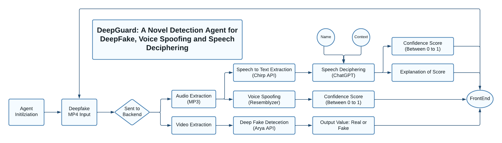

# DeepGuard: A Cutom Built Novel Detection Framework for Combating Deepfakes, Voice Spoofing and Speech Deciphering.

## We built out a novel agent framework to detect deepfakes, aritifical voice generation and falsified speech by creating a multimodal approach which utilized Video, Audio and Text extraction combined with the lastest AI frameworks. 

In the age of Social Media, deepfakes have become widely prevalent and more and more realistic. Our custom application, DeepGuard, built off a Novel Detection Framework, allows users to input a deepfake video and then takes a multimodal approach to accurately detect false video, speech or audio within the video and inform users. Unlike many current day detection algorithms, DeepFake is the first of its kind to be able to parse through the audio, video and speech of a video rathering than focusing on one of the three, making it more accurate and adaptable. Some cool key features include:

* Video Input: Users can choose any deepfake as long as it comes in MP4 format
* Name and Context Utilization: Users can choose to incorporate Name and Context to make speech Deciphering more accurate
* Audio and Video Extraction: Audio and Video feature extraction to make detection more accurate
* Speech to Text Extraction: Converts the Deepfake subject's speech to text 
* Speech Deciphering: Using ChatGPT, takes in name, context and text extraction to determine if subject of video would say the text in real life
* Voice Spoofing: ML algorithm trained on custom voice dataset to identify Real versus AI generated/Fake audio
* Visual Deepfake Detection: Runs video through Arya API to analyze Deepfake visually
* Test Customization: Allows user to run specific or all tests, making it applicable to any of the above domains
* UI Feedback: Outputs Confidence Scores for each test as well as custom explanation via ChatGPT
  

Built by Nyan Prakash, Shaunak Sinha, & Brennan Pan.
